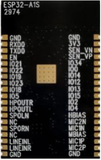
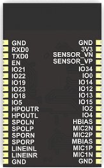

# 安信可音频开发板 SDK 框架


EN | [中文](./README-zh.md)

本框架是基于乐鑫音频框架 esp-adf 上二次开发并遵循官方开源协议，如有侵犯，请联系我们。

## 简介

- 本框架同样适合乐鑫的官方开发板比如esp-lyart，还以最全面的方式轻松添加功能，从简单到复杂开发音频应用程序：

  - 音乐播放器或录音机支持音频格式，例如MP3，AAC，FLAC，WAV，OGG，OPUS，AMR，TS，EQ，Downmixer，Sonic，ALC，G.711 ...
  - 从以下来源播放音乐：HTTP，HLS（HTTP实时流），SPIFFS，SDCARD，A2DP来源，A2DP接收器，HFP ...
  - 集成媒体服务，例如：DLNA，VoIP ...
  - 网络广播
  - 语音识别以及与Alexa，DuerOS等在线服务的集成...

## 如何在 ESP-ADF 框架二次开发

### 硬件

安信可 ESP-A1S 模组 V2.2 ES8388 版本 2957 丝印已替换 AC101版本 , 区别:

|              ESP32-A1S-Kit ES8388 模组（背部）               |               ESP32-A1S-Kit AC101 模组（背部）               |
| :----------------------------------------------------------: | :----------------------------------------------------------: |
|  | [](https://docs.espressif.com/projects/esp-adf/en/latest/get-started/get-started-esp32-lyratd-msc.html) |
|                  ESP32 + ES8388 audio chip                   |                   ESP32 + AC101 audio chip                   |

### 快速开始

#### Step 1. 设置 ESP-IDF 在 Windows, Linux 或Mac OS

参考环境设置 [get-started-setup-esp-idf](https://docs.espressif.com/projects/esp-adf/en/latest/get-started/index.html#get-started-setup-esp-idf)

#### Step 2. 获取 ESP-ADF 

```
git clone --recursive https://github.com/espressif/esp-adf.git
```

如果您克隆不带 `--recursive` 参数, 请在 `esp-adf` 文件夹里面运行 `git submodule update --init` 

#### Step 3. 设置 ESP-ADF 编译路径

编译 ESP-ADF 需要设置``ADF_PATH``路径. 这个是必须要设置的，否则无法编译。

**Windows**

打开终端并输入这个命令 :

```
set ADF_PATH=%userprofile%\esp\esp-adf
```

你需要确定这个 ADF_PATH  已经设置成功。

```
 echo %ADF_PATH%
```

这里应该会输出一个完整的文件夹路径.

**Linux and macOS**

打开终端并输入这个命令 :

    export ADF_PATH=~/esp/esp-adf

你需要确定这个 ADF_PATH  已经设置成功。

    printenv ADF_PATH

#### Step 4. 设置环境编译

在每次编译工程打开新终端窗口编译之前，ESP-IDF的所有依赖的工具都必须添加到环境里面去。ESP-IDF提供一个脚本，把所需的全部的以来环境工具都会集成到当前窗口。

**Windows**

[ESP-IDF Tools Installer](https://docs.espressif.com/projects/esp-idf/en/latest/esp32/get-started/windows-setup.html#get-started-windows-tools-installer) 这个插件搭建环境是会在桌面上生成一个 "ESP-IDF Command Prompt" 快捷方式的，这个快捷方式打开之后，就会把全部所需的依赖的工具添加到环境变量去，你必须打开这个快捷方式，才可以进行编译工程。

实际上, 如果你要使用 ESP-IDF 的快捷方式来完成以上操作 :

```
%userprofile%\esp\esp-idf\export.bat
```

或者打开 Windows PowerShell

```
.$HOME/esp/esp-idf/export.ps1
```

**Linux and macOS**

In the terminal where you have installed ESP-IDF, run:

```
. $HOME/esp/esp-idf/export.sh
```

Note the space between the leading dot and the path!

You can also create an alias for the export script to your `.profile` or `.bash_profile` script. This way you can set up the environment in a new terminal window by typing `get_idf`:

```
alias get_idf='. $HOME/esp/esp-idf/export.sh'
```

Note that it is not recommended to source `export.sh` from the profile script directly. Doing so activates IDF virtual environment in every terminal session (even in those where IDF is not needed), defeating the purpose of the virtual environment and likely affecting other software.

#### Step 5. Adapter ESP-A1S Module 

##### For ESP-A1S （ESP32 + ES8388 audio chips）

- status: on sale
- audio chips: ES8388 

**step 1** : alter the gpio connection ，path： ```esp-adf/components/audio_board/lyrat_v4_3/board_pins_config.c```

- sda_io: GPIO_33
- scl_io: GPIO_32
- bck_io: GPIO_NUM_27

the code as here:

```
esp_err_t get_i2c_pins(i2c_port_t port, i2c_config_t *i2c_config)
{
    AUDIO_NULL_CHECK(TAG, i2c_config, return ESP_FAIL);
    if (port == I2C_NUM_0 || port == I2C_NUM_1) {
        i2c_config->sda_io_num = GPIO_NUM_33;
        i2c_config->scl_io_num = GPIO_NUM_32;
    } else {
        i2c_config->sda_io_num = -1;
        i2c_config->scl_io_num = -1;
        ESP_LOGE(TAG, "i2c port %d is not supported", port);
        return ESP_FAIL;
    }
    return ESP_OK;
}

esp_err_t get_i2s_pins(i2s_port_t port, i2s_pin_config_t *i2s_config)
{
    AUDIO_NULL_CHECK(TAG, i2s_config, return ESP_FAIL);
    if (port == I2S_NUM_0 || port == I2S_NUM_1) {
        i2s_config->bck_io_num = GPIO_NUM_27;
        i2s_config->ws_io_num = GPIO_NUM_25;
        i2s_config->data_out_num = GPIO_NUM_26;
        i2s_config->data_in_num = GPIO_NUM_35;
    } else {
        memset(i2s_config, -1, sizeof(i2s_pin_config_t));
        ESP_LOGE(TAG, "i2s port %d is not supported", port);
        return ESP_FAIL;
    }
    return ESP_OK;
}
```

----------------------

##### For ESP-A1S （ESP32 + AC101 audio chips）

- status：halt production
- audio chips: AC101

**step 1** :  edit the component file  to add the AI Thinker Board to ESP-ADF :   [components/audio_board/component.mk](https://github.com/espressif/esp-adf/blob/master/components/audio_board/component.mk)  

```
ifdef CONFIG_ESP_AI_THINKER_V2_2_BOARD
COMPONENT_ADD_INCLUDEDIRS += ./ai_thinker_audio_kit_v2_2
COMPONENT_SRCDIRS += ./ai_thinker_audio_kit_v2_2
endif
```

**step 2** :  add the AI Thinker Board include files to ESP-ADF , add the code form the file [ai_thinker_audio_kit_v2_2](ESP32_AC101_Driver\ai_thinker_audio_kit_v2_2):


and add the below code to edit the config file  :   [components/audio_board/CMakeLists.txt](https://github.com/espressif/esp-adf/blob/master/components/audio_board/CMakeLists.txt)  

```
if (CONFIG_ESP_AI_THINKER_V2_2_BOARD)
message(STATUS "Current board name is " CONFIG_ESP_AI_THINKER_V2_2_BOARD)
list(APPEND COMPONENT_ADD_INCLUDEDIRS ./ai_thinker_audio_kit_v2_2)
set(COMPONENT_SRCS
./ai_thinker_audio_kit_v2_2/board.c
./ai_thinker_audio_kit_v2_2/board_pins_config.c
)
endif()
```

laster , add the below code to edit the default config  :   [components/audio_board/Kconfig.projbuild](https://github.com/espressif/esp-adf/blob/master/components/audio_board/Kconfig.projbuild)  

```
choice AUDIO_BOARD
    prompt "Audio board"
    default ESP_AI_THINKER_V2_2_BOARD
    help
        Select an audio board to use with the ESP-ADF
        
···
···

config ESP_AI_THINKER_V2_2_BOARD
    bool "ESP32-AiThinker-audio V2.2"
```

**step 3** :   add the AI Thinker Board AC101 driver files to ESP-ADF , add the code form the file [ac101](ESP32_AC101_Driver\ac101):


and add the below code to edit the default config  :   [components/audio_hal/component.mk](https://github.com/espressif/esp-adf/blob/master/audio_hal/component.mk)  

```
COMPONENT_ADD_INCLUDEDIRS += ./driver/ac101
COMPONENT_SRCDIRS += ./driver/ac101
```

laster , add the below code to edit the CMake file :   [components/audio_hal/CMakeLists.txt](https://github.com/espressif/esp-adf/blob/master/audio_hal/CMakeLists.txt)  

```
 ./driver/es8388
 ./driver/es8388/es8388.c
```


#### Step 6. Start a Project 

#####  For ESP-A1S （ESP32 + ES8388 audio chips）

cd ```examples/player/pipeline_bt_source``` , run ```idf.py menuconfig --- Audio Hal``` , select ```ESP32-Lyrat V4.3```


Flash the binaries that you just built onto your board by running :

```
idf.py -p PORT [-b BAUD] flash monitor
```

##### For ESP-A1S （ESP32 + AC101 audio chips）

cd ```examples/player/pipeline_bt_source``` , run ```idf.py menuconfig --- Audio Hal``` , select ```ESP_AI_THINKER_V2_2_BOARD```

Flash the binaries that you just built onto your board by running :

```
idf.py -p PORT [-b BAUD] flash monitor
```

##### 

# Resources

* [Documentation](https://docs.espressif.com/projects/esp-adf/en/latest/index.html) for the latest version of https://docs.espressif.com/projects/esp-adf/. This documentation is built from the [docs directory](docs) of this repository.
* The [aithinker  forum](http://bbs.ai-thinker.com/forum.php) is a place to ask questions and find community resources.
* If you're interested in contributing to ESP-ADF, please check the [Contributions Guide](https://esp-idf.readthedocs.io/en/latest/contribute/index.html).
* Support Email : xuhongv@aithinker.com
* thanks: https://github.com/xuhongv